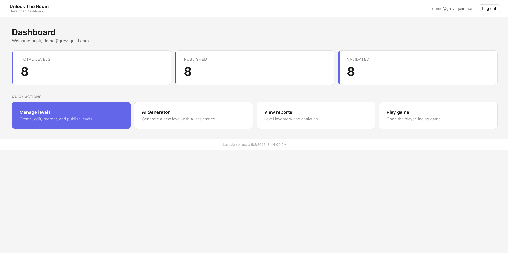
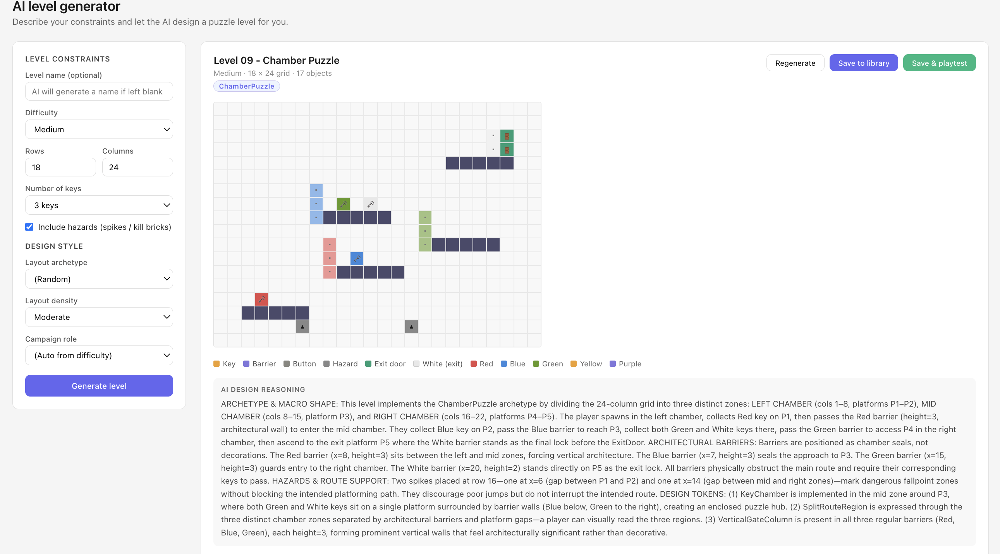
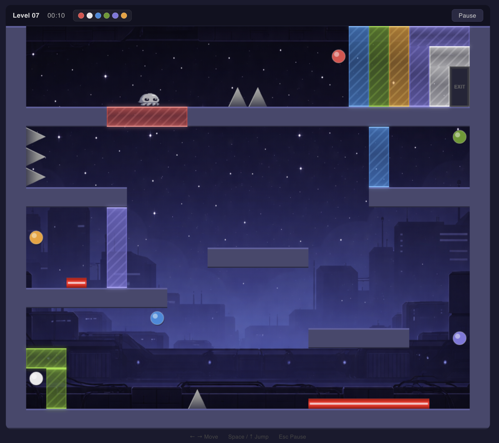

# 🦑 Unlock The Room

> Puzzle platformer with an AI co-designer. Solo full-stack build — .NET 8, React, PostgreSQL, Anthropic API.

**[▶ Live demo](https://unlock-the-room-frontend-production.up.railway.app)** — one-click tour of the developer dashboard, no account creation needed.


---

## TL;DR

A browser puzzle platformer where players collect color-coded keys to unlock barriers and reach the exit. The more interesting half is the **developer dashboard** — a React management suite with a live grid editor and an **AI level generator** that uses Claude to design playable, solvable puzzles from natural-language constraints.

Originally built as a senior capstone, then polished into a portfolio piece across a series of focused engineering passes covering public access, design system, game UI polish, dashboard refinements, and brand cohesion.

---

## Try it in 30 seconds

1. Visit the [live demo](https://unlock-the-room-frontend-production.up.railway.app).
2. Click **Tour the developer dashboard** — one-click demo login, no typing.
3. From the dashboard, the **AI Generator** is one click away. Generate a level, then click **Save & playtest** to play what you just built.

The demo state resets every 24 hours, so feel free to create, edit, or delete anything.

---

## How the AI level generator works

The most interesting piece of engineering in the project. The pipeline:

1. **Constraint capture.** The developer specifies grid dimensions, key count, hazard inclusion, and difficulty.
2. **Prompt assembly.** Constraints are encoded into a structured prompt requesting JSON output that describes the level — spawn point, platforms, keys (with colors), barriers (with required key colors), hazards, and exit.
3. **Claude API call.** Sent to `claude-haiku-4-5-20251001` with a strict JSON output schema.
4. **Server-side validation.** The returned level is parsed and run through a solvability check before reaching the client. Unsolvable levels (e.g., a barrier requires a key the player can't physically reach) are rejected and regenerated.
5. **Preview render.** The validated level is rendered to a grid preview with a legend and the model's design reasoning shown alongside.
6. **Save and playtest.** The developer either commits to the library, or saves and playtests immediately, returning to the generator afterward with constraints preserved for fast iteration.

**Key design decision:** constraining the model to grid coordinates rather than free-form positions. This made validation tractable and made the output reliably playable, at the cost of locking levels to a tile grid. Worth the trade — generation success rate jumped from "frequently nonsensical" to consistently solvable on the first attempt.

---

## Tech stack

| Layer | Tech |
|---|---|
| API | ASP.NET Core 8, C# |
| Frontend | React 18 |
| Game | HTML5 Canvas (vanilla, 60fps loop) |
| Database | PostgreSQL 16 + EF Core 8 |
| AI | Anthropic API (claude-haiku-4-5) |
| Auth | JWT (HMAC-SHA256) + BCrypt password hashing |
| Deploy | Docker + Railway, CI on push to main |
| Tests | xUnit + EF Core InMemory + Moq |

---

## Engineering decisions worth calling out

**Single-table inheritance for game objects.** The five object types (Key, Barrier, Button, Hazard, ExitDoor) all inherit from an abstract `GameObject` and map to one `GameObjects` table via EF Core's Table-Per-Hierarchy strategy. The trade is wider rows with type-specific nullable columns, in exchange for fast level loading (one query, no joins) and simple polymorphic deserialization. Worth it given levels are read-heavy and rarely contain more than ~30 objects.

**State transitions through services, not controllers.** Controllers are thin — they validate input shape and delegate. All business rules (key collection unlocks barriers, level deletion cascades to scores and saves, email normalization on registration) live in service classes. Made the test suite straightforward to write and the controllers straightforward to read.

**Connected-component cell merging for canvas rendering.** Adjacent same-color barriers (and adjacent platforms / kill bricks) used to render as separate shapes, producing a visible seam at every object boundary because each shape's stripe and gradient pattern reset at its own bounding box. Fixed by grouping cells via BFS flood fill at level load and rendering each merged group as one continuous shape, with the gradient and stripe origin computed from the group's bounding box rather than per-object. Different-color barriers still produce separate groups and render with visible seams between them — gameplay distinction preserved.

**Unified routing context for playtest flow.** The game can be entered for "playtest" from two places (AI Generator and Level Management edit screen), and both should return to where the user came from with that level still in focus. Rather than branching exit handlers per entry point, all four exit paths (Next level, Save, Change level, Esc → Main Menu) consult a single `fromContext` state and route accordingly. Adding a third entry point in the future (e.g., a public level gallery) becomes one new case in `returnToContext`, not a deepening conditional in three different handlers.

**Fail-fast on missing config.** The demo email originally had a fallback string literal (`?? "demo@greysquiid.com"`). Replaced with `?? throw new InvalidOperationException(...)` — if the config key is missing in production, the app fails loudly at startup instead of silently using a stale email weeks later.

**Two-layer validation.** Client-side validation in React for immediate feedback, server-side re-validation before any DB write. Email is normalized to lowercase and trimmed at the service layer to prevent case-sensitive duplicate accounts. Parameterized queries throughout EF Core block SQL injection by construction.

**Cost guards on the AI endpoint.** With the demo publicly accessible, the AI generation endpoint becomes a potential abuse vector. Per-IP rate limiting (10 generations/hour) plus an account-level monthly budget cap on the Anthropic side keeps surprise bills off the table.

**On AI tooling.** Built with Claude as an implementation partner. Architecture decisions, debugging strategy (including a production demo-login bug traced to a `.dockerignore` exclusion, a leaked-secret incident response, and a polygon-merge rendering bug investigation through a flawed first fix into the right architectural answer), and code review are mine; routine implementation was accelerated by AI tooling. The design rationale is documented in [`DESIGN.md`](DESIGN.md) and the commit history.

---

## Architecture

```
[Browser]
   │
   ├── /          → Landing page (one-click tour of the dashboard)
   ├── /play      → React game client (HTML5 Canvas, 60fps loop)
   └── /dashboard → React management dashboard (Developer role only)
   │
   ▼
[ASP.NET Core API] ──► [Anthropic API] (AI level generation)
   │
   ▼
[PostgreSQL]
```

Demo state is restored every 24 hours by a `DemoResetService` background job that reads from a canonical level snapshot in the repo. The demo data is consistent across visitors regardless of what the previous visitor did.

---

## Screenshots

| Dashboard | AI Generator | Game |
|---|---|---|
|  |  |  |

---

## Testing

24 xUnit tests covering the service layer — `UserService` (auth, registration, email normalization, demo login), `LevelService` (CRUD, search, filters), `ScoreService` (submission, leaderboards, ownership). Each test runs against a fresh in-memory EF Core database. 100% pass rate.

```bash
cd backend/UnlockTheRoom.Tests
dotnet test
```

---

## Roadmap

What I'd build next, roughly in priority order:

- **Persistent player profiles and leaderboards.** The data model supports it; the player-side UI doesn't surface it yet.
- **Public level gallery.** AI-generated levels could be shared to a gallery with upvoting and play counts.
- **More AI integration.** Hint generation for stuck players, automatic difficulty scoring of human-designed levels, adaptive level selection based on player history.
- **Mobile touch controls.** Keyboard-only today.
- **Asset pipeline upgrade.** Current barrier and platform rendering is procedural canvas drawing. Migrating to a proper tile atlas would tighten visuals and free up CPU.

---

## Project structure

<details>
<summary>Click to expand</summary>

```
D424/
├── backend/
│   ├── UnlockTheRoom.API/
│   │   ├── Controllers/
│   │   ├── Data/           # AppDbContext, TPH configuration
│   │   ├── DTOs/
│   │   ├── Migrations/
│   │   ├── Models/         # GameObject (abstract) + 5 child classes
│   │   ├── Services/       # Business logic, demo reset background job
│   │   ├── SeedData/       # Canonical level snapshots for demo reset
│   │   └── Program.cs
│   └── UnlockTheRoom.Tests/
└── frontend/
    └── unlock-the-room-ui/
        ├── public/         # Squid sprite, screenshots, backgrounds
        ├── src/
        │   ├── components/
        │   │   ├── LevelEditor.js
        │   │   └── game/   # GameCanvas, MainMenu, LevelSelect,
        │   │              #   ParallaxBackground, LevelThumbnail
        │   ├── pages/      # Dashboard, Levels, Reports, AiGenerator,
        │   │              #   Game, LandingPage, NotFound
        │   ├── gameColors.js   # Canvas color constants
        │   └── config.js   # DEMO_EMAIL, DEMO_PASSWORD constants
        └── nginx.conf
```

</details>

---

## Local development

See [SETUP.md](SETUP.md) for the full local setup guide — database, API, frontend, tests, and Docker.

For design decisions, color tokens, and the AI budget guidance, see [DESIGN.md](DESIGN.md).

---

## License & attribution

Built solo by [Joshua Davidson](https://github.com/GreySquiid) (GreySquiid Studios). Source available for review and learning; attribution appreciated if you reuse parts of it.

Originally developed as the WGU D424 Software Engineering Capstone (2026), then polished as a portfolio piece.
